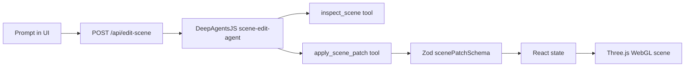

# AI Edits 3D Scene

A small, real demo: prompt a DeepAgentsJS agent, get a constrained scene patch, and apply it to a live Three.js scene.

This repo is built to be recorded and shared. The deterministic preset buttons are useful for capture, while the `Run GLM agent` button calls the real agent path when `OPENROUTER_API_KEY` is configured.

## What It Shows

- React + Vite UI with a live WebGL canvas.
- Three.js scene state for material, lighting, camera, and environment.
- A richer base scene with a copilot console, HUD panels, telemetry bars, scan rings, and split comparison.
- DeepAgentsJS agent with a local scene-editor skill.
- LangChain OpenRouter integration using `z-ai/glm-5.1` by default.
- A strict Zod schema so model output becomes a safe, inspectable scene patch.

## Architecture



The agent is intentionally not allowed to write arbitrary scene code. It edits a structured patch:

- `material`: color, emissive color, metalness, roughness, opacity
- `lighting`: key/rim color and intensity
- `camera`: distance, height, orbit speed
- `environment`: background, fog, floor color
- `hud`: telemetry colors, panel color, grid color, density, scan speed
- `diff`: human-readable before/after rows for the post
- `xHook`: short social copy

The UI also includes focused edit targets and comparison modes:

- Edit targets: full scene, material, lighting, camera, environment, HUD accents
- View modes: before, AI edit, split compare, diff highlight

## Run Locally

```bash
npm install
cp .env.example .env.local
npm run dev
```

Open [http://127.0.0.1:5174](http://127.0.0.1:5174).

Preset edits work without any API key. To run the real agent path:

```bash
OPENROUTER_API_KEY=your_key_here
OPENROUTER_MODEL=z-ai/glm-5.1
```

The dev server loads `.env.local` and `.env`. After setting the key, restart `npm run dev` and click `Run GLM agent`.

## Verification

```bash
npm test
npm run build
```

## Source Credit

This project is inspired by the idea of connecting agents to 3D scene editing workflows. It links to [DmitriyGolub/threejs-devtools-mcp](https://github.com/DmitriyGolub/threejs-devtools-mcp) as upstream inspiration, but does not vendor that code.

Core libraries:

- [DeepAgentsJS](https://github.com/langchain-ai/deepagentsjs)
- [LangChain OpenRouter](https://reference.langchain.com/javascript/langchain-openrouter)
- [Three.js](https://threejs.org/)

## License

MIT
